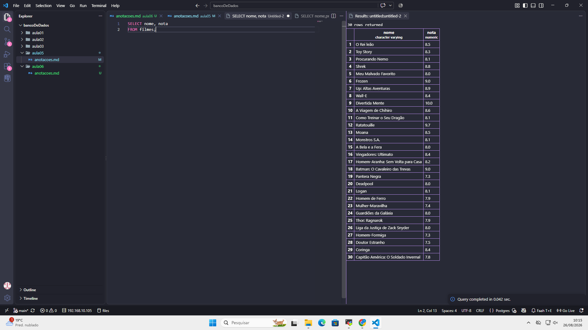
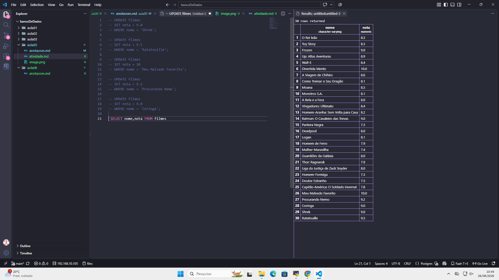
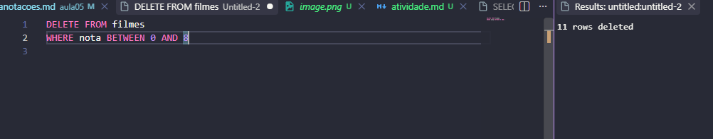

### Ativade filmes

# Anotações – Banco de Dados de Streaming

## 1. Criação do banco de dados

Primeiro, criamos um banco de dados chamado `streaming_filmes`.

```sql
CREATE DATABASE streaming_filmes;
```

Depois, conectamos o VS Code ao banco de dados criado para começar a trabalhar nele.

## 2. Criação da tabela

Criamos uma tabela chamada `filme`.

A tabela possui 4 colunas:

* `id` → identifica cada filme.
* `nome` → guarda o nome do filme.
* `duracao_minutos` → guarda a duração em minutos.
* `nota` → guarda a avaliação de 0 a 10.

O `id` foi configurado como `PRIMARY KEY`, para cada filme ter um identificador único.

## 3. Inserção dos registros

Depois da criação da tabela, usamos o comando `INSERT INTO` para colocar os filmes.

Foram adicionados **30 registros**.

Exemplo:

```sql
INSERT INTO filme (nome, duracao_minutos, nota)
VALUES ('Interestelar', 169, 8.7);
```

O banco gera o ID automaticamente.

## 4. Consulta dos dados

Depois de inserir os registros, fizemos uma consulta utilizando o `SELECT`.

Como o exercício pedia somente o nome e a nota, usamos:

```sql
SELECT nome, nota
FROM filme;
```

Assim, não mostramos todas as colunas, somente as que foram solicitadas:


## 5. Atualização das notas

Depois, alteramos a nota de 5 filmes que já tinham sido cadastrados:


## 6. Apagar os filmes com notas baixas

Depois apagamos os filmes com notas abaixo de 8:



