## para criar a tabela:
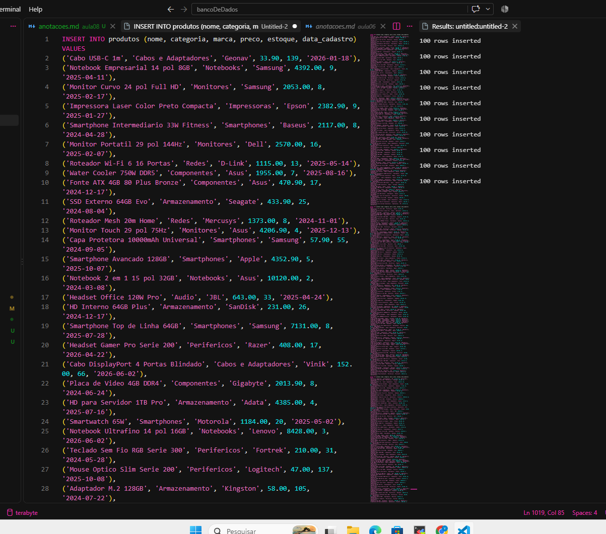

## PARTE A

## A1
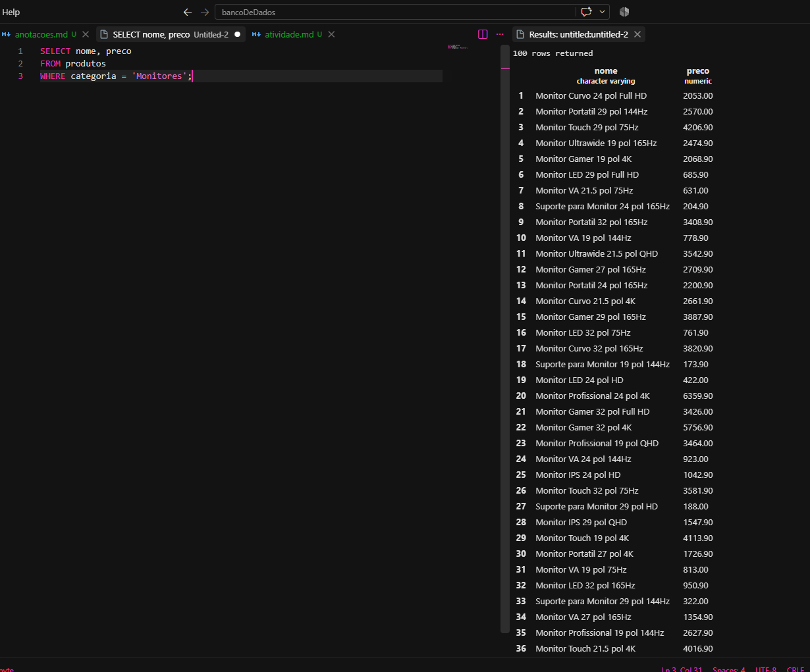

## A2

## A3
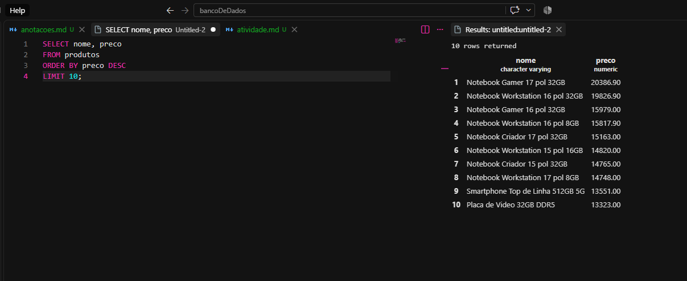

## A4
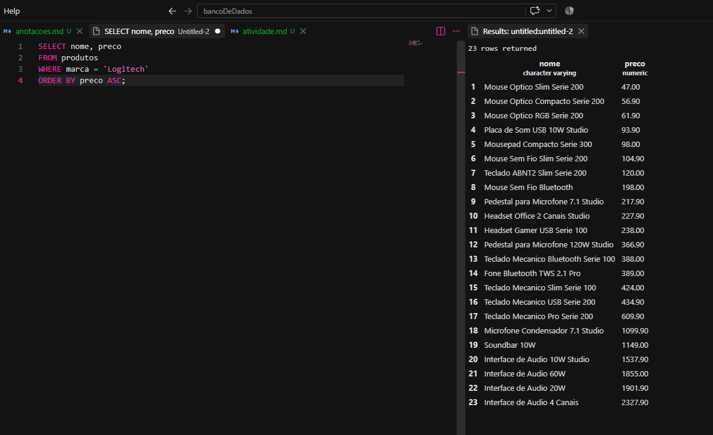

## A5
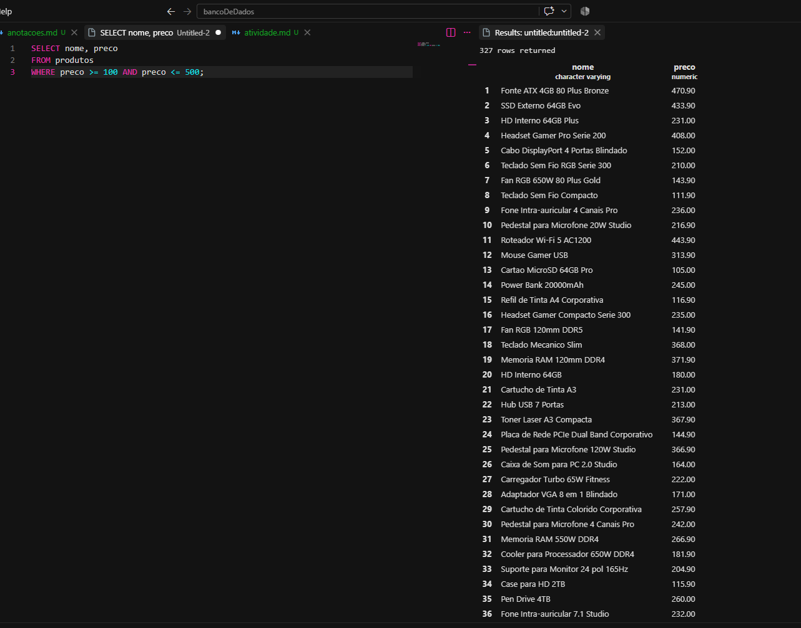

## PARTE B

## B1
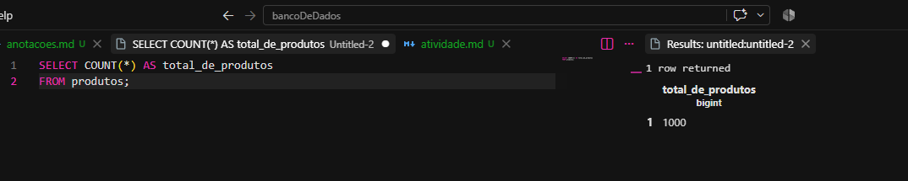

## B2
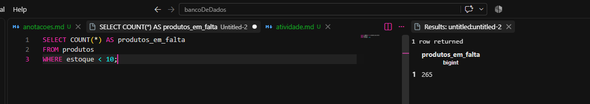

## B3
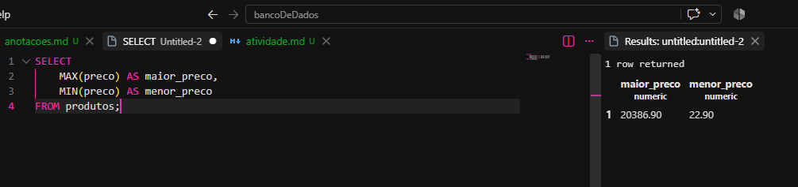

## B4
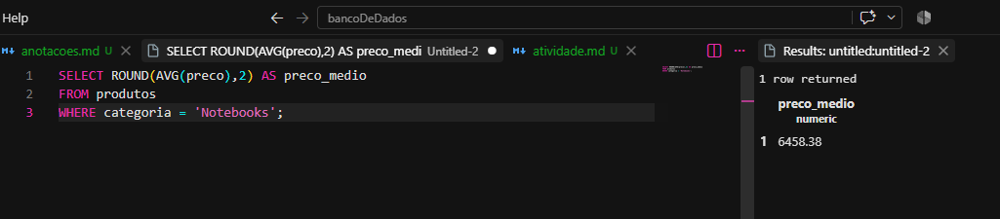

## B5
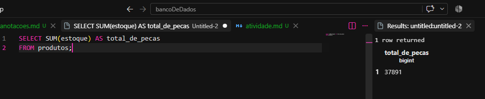

## PARTE C

## C1
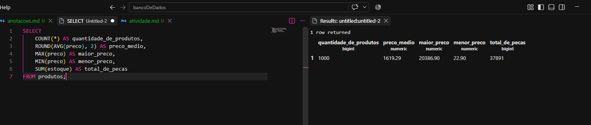

## C2
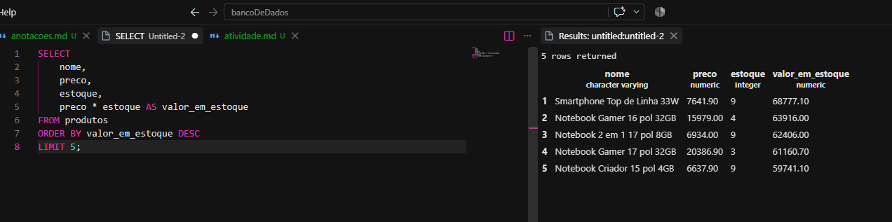

## C3
Produto A
Preço: R$ 5.000
Estoque: 1
Valor parado: R$ 5.000

Produto B
Preço: R$ 2.000
Estoque: 10
Valor parado: R$ 20.000

Mesmo sendo mais barato individualmente, o Produto B representa muito mais dinheiro parado, então o estoque também importa
