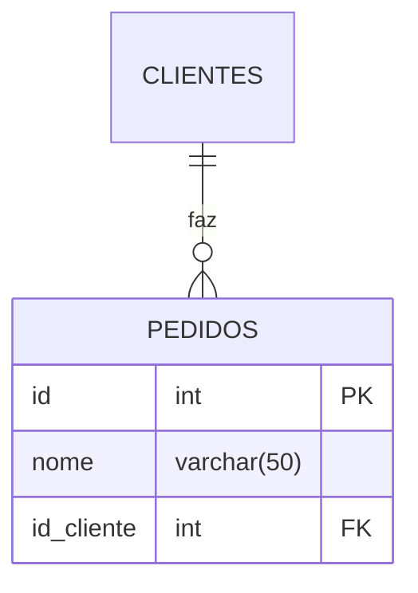

# Relacionamentos entre tabelas

- Ideia principal: Um cliente pode possuir vários pedidos. 

## Diagrama



1-Primeiro, criamos a nossa tabela:
```sql
CREATE TABLE clientes(
    id SERIAL PRIMARY KEY,
    nome VARCHAR(50) NOT NULL
);
```
2-Criamos a tabela dos pedidos, referenciando com a coluna ID da tabela clientes:
```sql
CREATE TABLE pedidos(
    id SERIAL PRIMARY KEY,
    produto VARCHAR(50) NOT NULL,
    id_cliente INT REFERENCES clientes(id)
);
```
3-Inserimos os clientes:
```sql
INSERT INTO clientes(nome) VALUES
('Hannah'),
('Miguel'),
('Murilo'),
('Lucas');
```
4-Inserimos os pedidos e seus respectivos clientes:
```sql
INSERT INTO pedidos (produto,id_cliente) VALUES
('Chocolate', 3),
('Salgado', 1),
('Refri', 2),
('Chocolate', 1);
```
5-Para verificar oque cada cliente comprou:
```sql
SELECT clientes.nome,pedidos.produto
FROM pedidos
INNER JOIN clientes ON pedidos.id_cliente = clientes.id;
```
6- Para verificar todos os clientes, até os que não compraram nada:
```sql
SELECT clientes.nome,pedidos.produto
FROM clientes
LEFT JOIN pedidos ON pedidos.id_cliente =clientes.id;
```

7- Para filtrar somente quem NÃO comprou: 
```sql
SELECT clientes.nome,pedidos.produto
FROM clientes
LEFT JOIN pedidos ON pedidos.id_cliente =clientes.id
WHERE pedidos.id IS NULL;
```


---

## Comandos
O comando para fazer a relação entre tabela é o:
```sql
REFERENCES nome_tabela(coluna)
```

Para juntar dados de duas tabelas que tem informações em comum 
```sql
INNER JOIN
```
Quem define como as tabelas se relacionam:
```sql
ON
```