# JOIN na Biblioteca da Escola

- Ideia principal: relacionar os alunos com os livros que eles pegaram.

## Diagrama

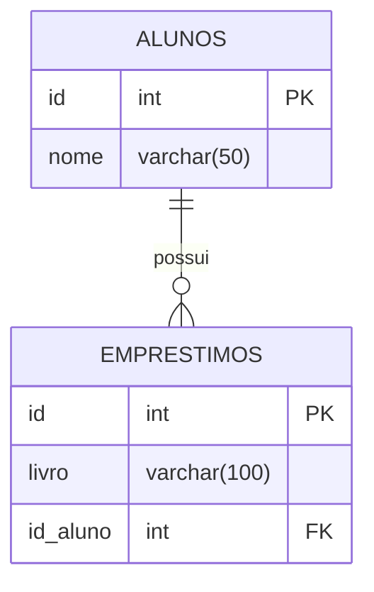

## criacao banco dedados:
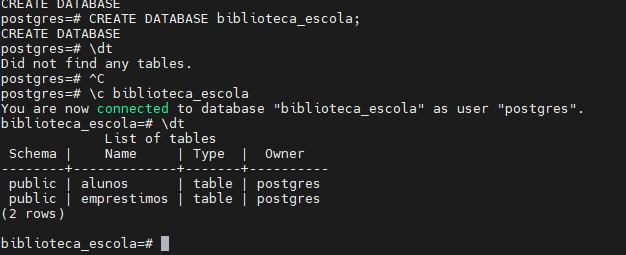

## criação das tabelas:
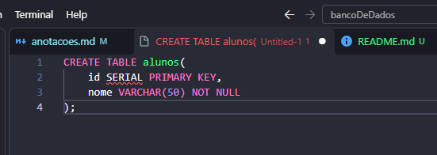
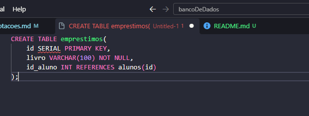

## adicionando nomes:
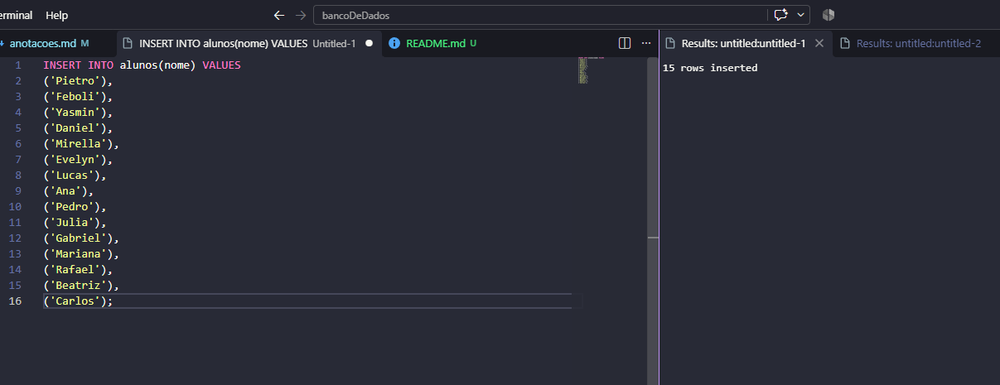

## incluindo os empretimos:
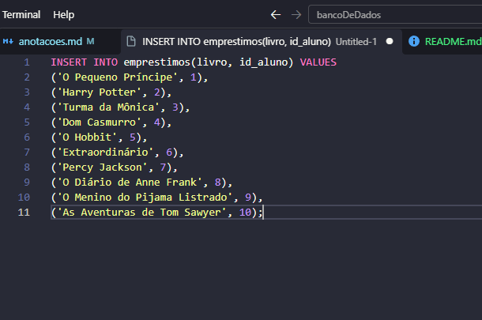

## tabela alunos:
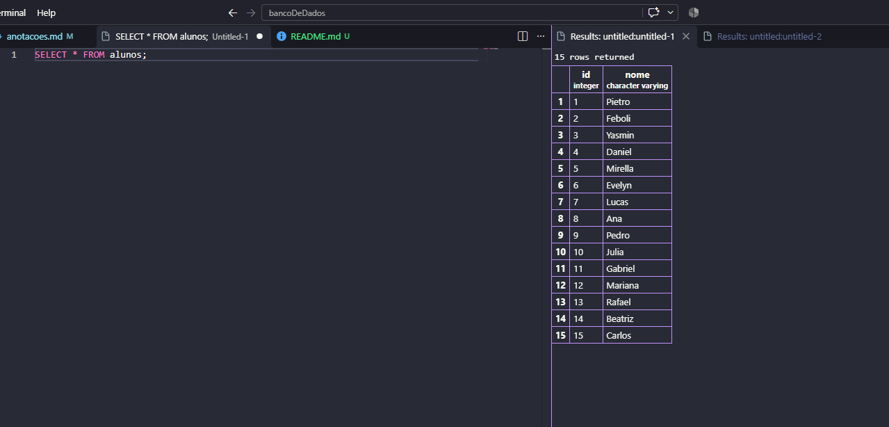

## tabela emprestimo: 
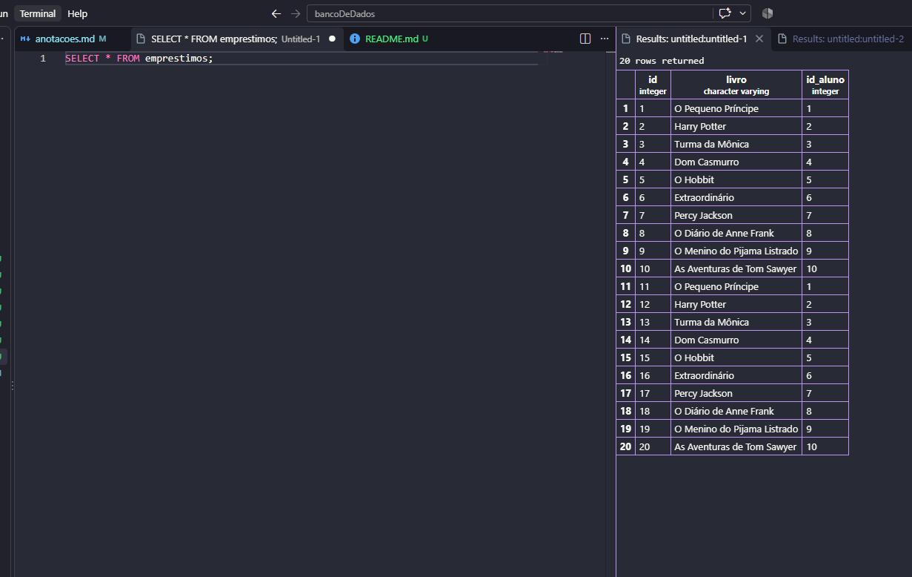

## nomes e livros:
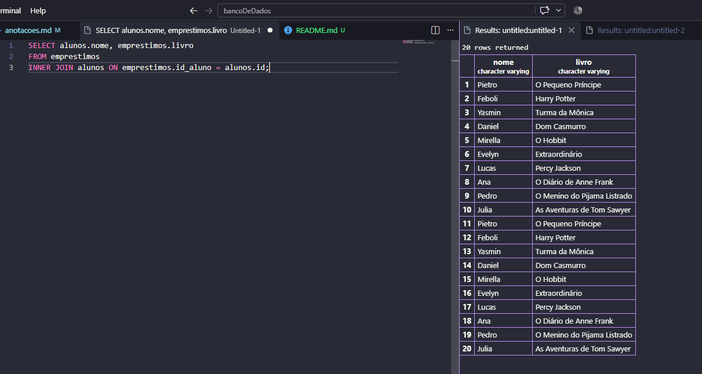
**R: Os alunos que não apareceram foram os que não pegaram nenhum livro. Isso acontece porque o INNER JOIN mostra somente os alunos que possuem empréstimo.**

## todos os alunos:
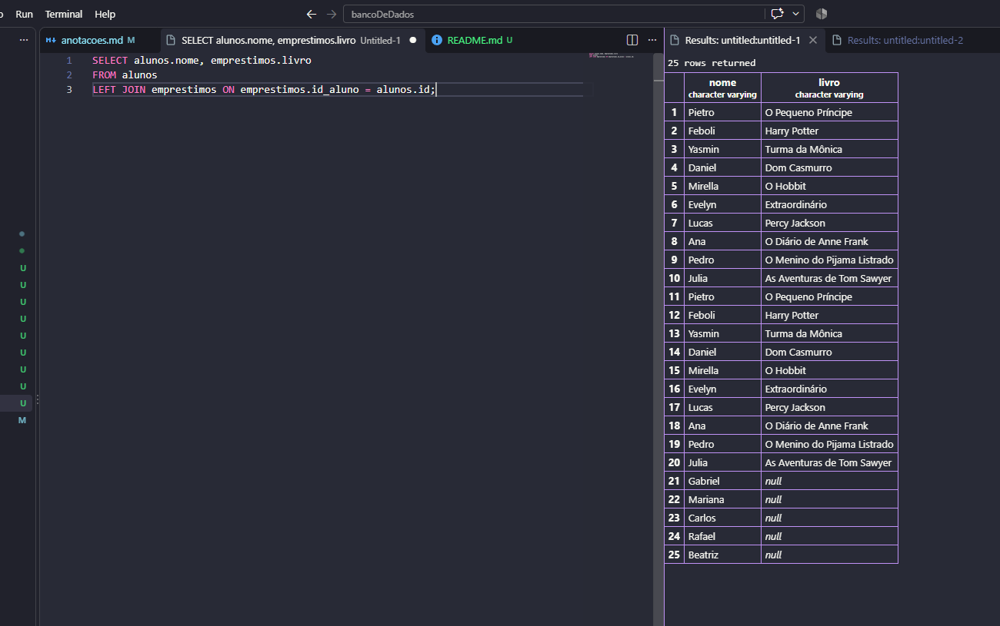
**R:Resposta: Para os alunos que não pegaram nenhum livro, apareceu NULL na coluna livro.**

## quem nunca pegou livro:
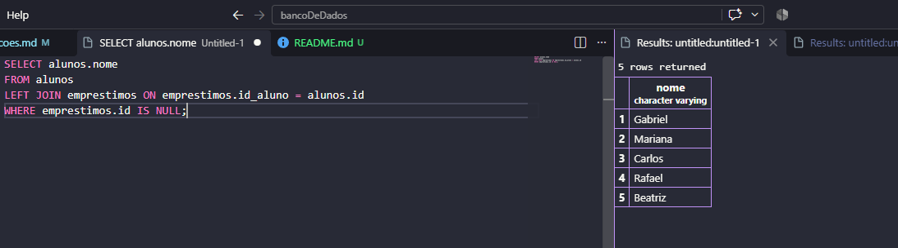
**R:Resposta: Os alunos que nunca pegaram livro foram Gabriel, Mariana, Rafael, Beatriz e Carlos.**
## aluno 50:
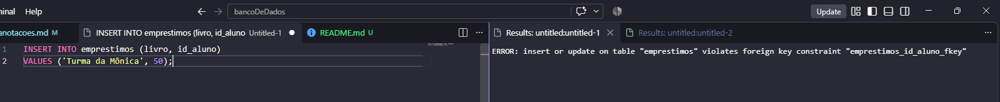
**R:Deu erro porque o aluno 50 não existe na tabela alunos. O id_aluno é uma chave estrangeira e precisa existir na tabela alunos.**

